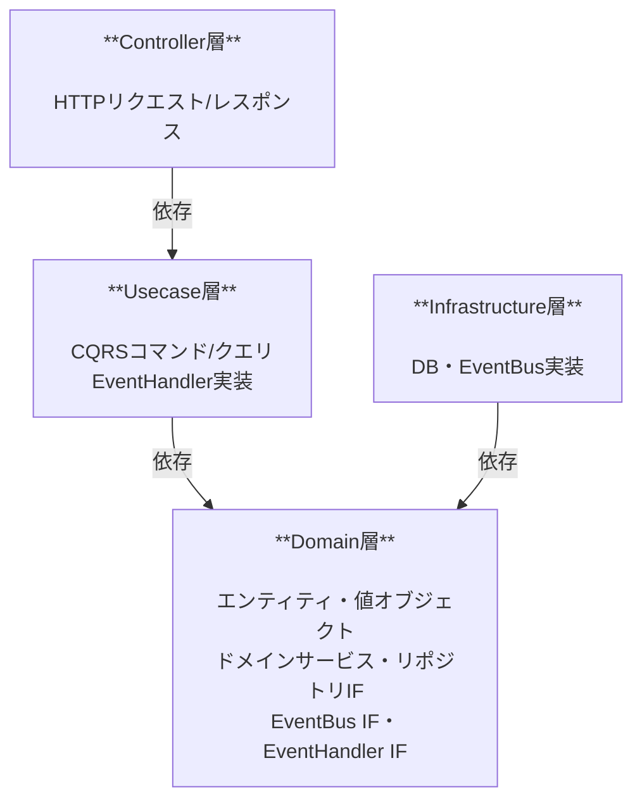

# 技術仕様書

## 技術スタック

| 要素         | 採用技術   |
| ------------ | ---------- |
| 言語         | Go         |
| HTTPサーバー | net/http   |
| ORM          | gorm       |
| データベース | PostgreSQL |
| テスト       | testify    |

---

## アーキテクチャ

### オニオンアーキテクチャ層構成

#### イベントバスの依存方向

インメモリイベントバスの配信ロジックは Infrastructure 層に実装するが、Infrastructure が Usecase を直接参照するとオニオンアーキテクチャの依存方向（外側→内側のみ）に反する。そのため以下の設計を採用する。

| 要素                            | 定義場所          | 説明                                                                                      |
| ------------------------------- | ----------------- | ----------------------------------------------------------------------------------------- |
| `EventBus` インターフェース     | Domain層          | イベント発行口。Usecase がイベントを publish するために参照する                           |
| `EventHandler` インターフェース | Domain層          | イベント購読口。Infrastructure の EventBus がこのインターフェース経由でハンドラを呼び出す |
| `EventBus` 実装                 | Infrastructure層  | `EventHandler` のスライスを保持し、イベントを受け取ったら順に呼び出す                     |
| `EventHandler` 実装             | Usecase層         | ドメインイベントを受け取り、対応するユースケース処理（例: 担当者除外）を実行する          |
| ハンドラ登録                    | `cmd/api/main.go` | Usecase の EventHandler を Infrastructure の EventBus に DI する（依存の組み立て場所）    |

これにより Infrastructure は Domain インターフェースのみに依存し、Usecase パッケージを直接参照しない。

### 層ごとのデータ構造

| 層               | 入力                | 出力                 |
| ---------------- | ------------------- | -------------------- |
| Controller層     | `xxxRequest` 構造体 | `xxxResponse` 構造体 |
| Usecase層        | `xxxParams` 構造体  | `xxxDTO` 構造体      |
| Domain層         | —                   | ドメインオブジェクト |
| Infrastructure層 | —                   | —                    |

- Controller はリクエストを `xxxRequest` で受け取り、`xxxParams` に変換して Usecase を呼び出す
- Usecase は `xxxParams` を受け取り、処理結果を `xxxDTO` に詰めて Controller に返す
- Controller は `xxxDTO` を `xxxResponse` に変換してレスポンスを返す

### CQRSの適用範囲

- **コマンド（Write側）:** ドメインモデル経由でビジネスルールを適用し、PostgreSQLに書き込む
- **クエリ（Read側）:** ドメインモデルを経由せず、クエリ専用のDTOでPostgreSQLから直接読み込む（JOIN・集計を最適化）

---

## 非機能要件

### バリデーション

- 入力値・ビジネスルール検証ともにドメイン層にて実施

### エラーハンドリング

| エラー種別           | HTTPステータス |
| -------------------- | -------------- |
| バリデーションエラー | 400            |
| リソース未存在       | 404            |
| ドメインルール違反   | 422            |
| サーバーエラー       | 500            |

### テスト方針

- ユニットテストは `testify`（`assert` / `require` / `mock`）を採用する
- Domain 層で定義したインターフェース（`UserRepository`・`TaskRepository`・`EventBus` 等）のモックは、テスト用パッケージ `backend/internal/domain/mocks/` に testify/mock ベースで実装する
  - テスト関数内に手書きの fake / stub を都度書かない（再利用性と一貫性のため）
  - モックは Domain インターフェースを満たす必要があり、`mocks` パッケージは Domain にのみ依存する
  - プロダクションコードから `mocks` パッケージを参照することは禁止（テストファイルからのみ import）

### 学習優先の設計判断

| 判断             | 内容                                         |
| ---------------- | -------------------------------------------- |
| 認証             | 実装しない                                   |
| イベントバス     | シンプルなインメモリ実装                     |
| ページネーション | オフセットベース                             |
| テスト           | ドメイン層、インフラ層のユニットテストを必須 |
