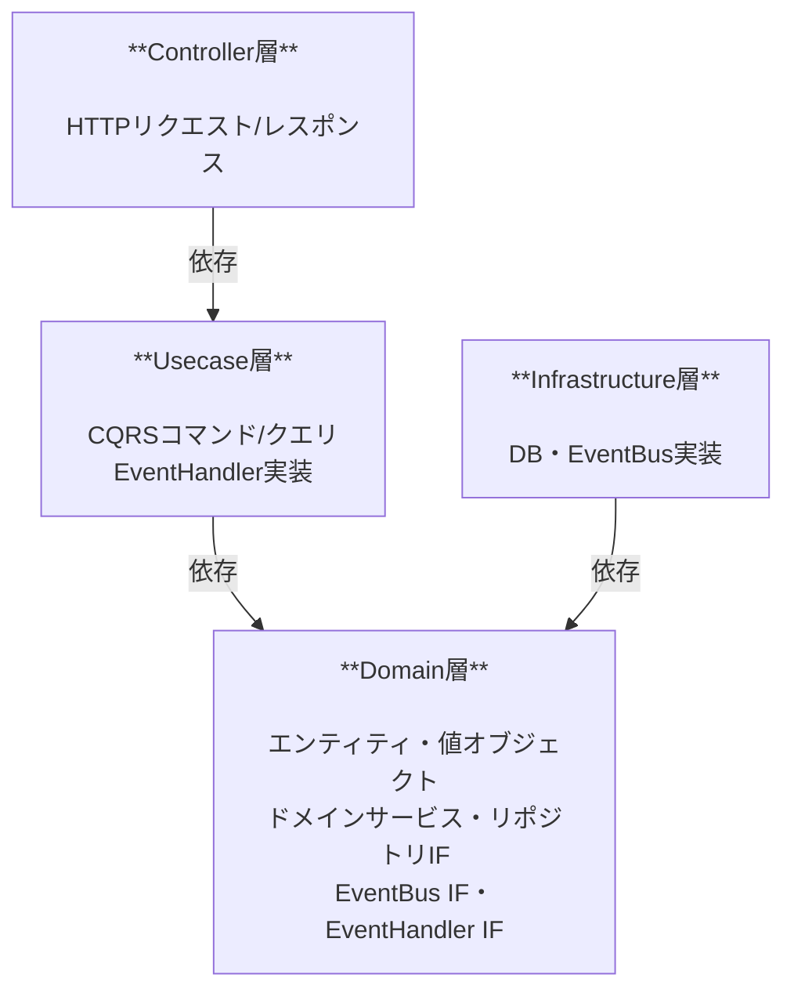
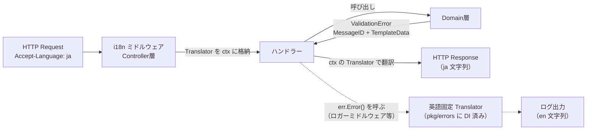

# 技術仕様書

## 技術スタック

| 要素         | 採用技術   |
| ------------ | ---------- |
| 言語         | Go         |
| HTTPサーバー | net/http   |
| ORM          | gorm       |
| データベース | PostgreSQL |
| テスト       | testify    |

---

## アーキテクチャ

### オニオンアーキテクチャ層構成



#### イベントバスの依存方向

インメモリイベントバスの配信ロジックは Infrastructure 層に実装するが、Infrastructure が Usecase を直接参照するとオニオンアーキテクチャの依存方向（外側→内側のみ）に反する。そのため以下の設計を採用する。

| 要素                            | 定義場所          | 説明                                                                                      |
| ------------------------------- | ----------------- | ----------------------------------------------------------------------------------------- |
| `EventBus` インターフェース     | Domain層          | イベント発行口。Usecase がイベントを publish するために参照する                           |
| `EventHandler` インターフェース | Domain層          | イベント購読口。Infrastructure の EventBus がこのインターフェース経由でハンドラを呼び出す |
| `EventBus` 実装                 | Infrastructure層  | `EventHandler` のスライスを保持し、イベントを受け取ったら順に呼び出す                     |
| `EventHandler` 実装             | Usecase層         | ドメインイベントを受け取り、対応するユースケース処理（例: 担当者除外）を実行する          |
| ハンドラ登録                    | `cmd/api/main.go` | Usecase の EventHandler を Infrastructure の EventBus に DI する（依存の組み立て場所）    |

これにより Infrastructure は Domain インターフェースのみに依存し、Usecase パッケージを直接参照しない。

#### pkg/errors の位置づけ

`backend/pkg/errors/` は Domain 層と同格の **最内層**として扱う。配置場所が `internal/domain/` の外であるのは「ドメインエラー種別と薄いインターフェースだけを集めた、他層から横断的に参照される最小モジュール」として独立させているためで、依存方向上は Domain 層と同じ最も内側に位置づけられる。

| ルール                                                            | 理由・適用                                                                                               |
| ----------------------------------------------------------------- | -------------------------------------------------------------------------------------------------------- |
| `pkg/errors` は他層・外部ライブラリに依存しない                   | 最内層のため。go-i18n 等の翻訳ライブラリにも依存させない                                                 |
| Domain 層は `pkg/errors` のエラー型を return してよい             | ドメインメソッドのエラーは `pkg/errors` で定義された型（`ValidationError` 等）を使う                     |
| Infrastructure 層は `pkg/errors` のインターフェースを実装してよい | `Translator` を Infrastructure 層で実装し、起動時に `pkg/errors` へ DI する（`EventBus` と同じパターン） |

### 層ごとのデータ構造

| 層               | 入力                | 出力                 |
| ---------------- | ------------------- | -------------------- |
| Controller層     | `xxxRequest` 構造体 | `xxxResponse` 構造体 |
| Usecase層        | `xxxParams` 構造体  | `xxxDTO` 構造体      |
| Domain層         | —                   | ドメインオブジェクト |
| Infrastructure層 | —                   | —                    |

- Controller はリクエストを `xxxRequest` で受け取り、`xxxParams` に変換して Usecase を呼び出す
- Usecase は `xxxParams` を受け取り、処理結果を `xxxDTO` に詰めて Controller に返す
- Controller は `xxxDTO` を `xxxResponse` に変換してレスポンスを返す

### CQRSの適用範囲

- **コマンド（Write側）:** ドメインモデル経由でビジネスルールを適用し、PostgreSQLに書き込む
- **クエリ（Read側）:** ドメインモデルを経由せず、クエリ専用のDTOでPostgreSQLから直接読み込む（JOIN・集計を最適化）

---

## 非機能要件

### バリデーション

- 入力値・ビジネスルール検証ともにドメイン層にて実施

### エラーハンドリング

| エラー種別           | HTTPステータス |
| -------------------- | -------------- |
| バリデーションエラー | 400            |
| リソース未存在       | 404            |
| ドメインルール違反   | 422            |
| サーバーエラー       | 500            |

### 国際化（i18n）

エラーメッセージは英語（デフォルト）と日本語の 2 言語に対応する。`github.com/nicksnyder/go-i18n/v2/i18n` を採用し、翻訳ファイルは YAML（`gopkg.in/yaml.v3`）で記述する。

#### 設計原則

- **ドメインエラーは翻訳キーのみを持つ**。`pkg/errors` で定義されるすべてのドメインエラー（`ValidationError`・`NotFoundError`・`DomainRuleError` 等）は `MessageID`（例: `validation.email.required`）と `TemplateData`（テンプレート変数）を保持し、人間可読な文字列は持たない。Domain 層は go-i18n に依存しない
- **Domain 層と `Translator` の関係**。Domain 層は `pkg/errors` のエラー型を return するだけで、`Translator` インターフェース自体は参照しない。`Translator` は `pkg/errors` 内部で `Error()` メソッドから利用される
- **翻訳は外側で行う**。HTTP レスポンス用の翻訳は Controller 境界で `Accept-Language` ヘッダから生成した `*i18n.Localizer` により実施する
- **`Error()` 用にデフォルト言語（英語）の翻訳器を `pkg/errors` に注入する**。これにより `err.Error()` がログ等に出力される際、英語の完成文（例: `validation error: email: is required`）が得られる。`pkg/errors` は go-i18n に直接依存せず、薄い `Translator` インターフェース（`Translate(messageID string, templateData map[string]any) string`）だけを公開し、起動時に Infrastructure 層の実装を `errors.SetDefaultTranslator` で注入する
- **Translator 未注入時のフォールバック**。`SetDefaultTranslator` が呼ばれる前に `Error()` が呼ばれた場合（テスト等）は、`MessageID` 文字列をそのまま返す（panic させない）

#### 構成要素

| 要素                                   | 配置場所                                            | 責務                                                                                                                                                                                       |
| -------------------------------------- | --------------------------------------------------- | ------------------------------------------------------------------------------------------------------------------------------------------------------------------------------------------ |
| `Translator` インターフェース          | `pkg/errors`                                        | `Translate(messageID, templateData) string` のみを持つ薄いIF。`ValidationError`・`NotFoundError`・`DomainRuleError` 等の `Error()` から参照される                                          |
| `*i18n.Bundle`                         | Infrastructure 層（`internal/infrastructure/i18n`） | 全言語のメッセージを保持する singleton。アプリ起動時に YAML を読み込んで 1 回構築                                                                                                          |
| 英語固定 `Translator` 実装             | Infrastructure 層                                   | `Bundle` をラップし、英語固定の Localizer で翻訳する。起動時に `errors.SetDefaultTranslator` で `pkg/errors` に注入                                                                        |
| リクエスト用 `Translator` 実装         | Infrastructure 層                                   | リクエストの `Accept-Language` から都度 `*i18n.Localizer` を生成しラップする                                                                                                               |
| context key・`TranslatorFrom` ヘルパー | Infrastructure 層（`internal/infrastructure/i18n`） | リクエスト用 Translator を `context.Context` に出し入れするための非公開 key と取り出し関数（例: `i18n.TranslatorFrom(ctx) errors.Translator`）。Controller 層から使う                      |
| i18n ミドルウェア                      | Controller 層                                       | `Accept-Language` を読み、リクエスト用 Translator を `TranslatorFrom` 用の context key で `context.Context` に格納する                                                                     |
| 翻訳ファイル                           | `backend/locales/`                                  | `en.yaml`・`ja.yaml`。MessageID をネストしたキーで階層化。Go コードではなく静的リソースのため、Infrastructure 層の中ではなく `backend/` 直下に配置し、`embed` で取り込まない実ファイル運用 |

#### データフロー



`err.Error()` を呼ぶ主体は Controller 層のロガー/recover ミドルウェアを想定する。Domain 層自身は `err.Error()` を呼ばず、エラーを上位に返すだけにとどめる。

#### サポート言語

| 言語タグ | 用途                                                                                                   |
| -------- | ------------------------------------------------------------------------------------------------------ |
| `en`     | デフォルト言語。`Accept-Language` が未指定または未対応の場合のフォールバック。`err.Error()` の出力言語 |
| `ja`     | 日本語クライアント向け                                                                                 |

### テスト方針

- テストフレームワークは `testify`（`assert` / `require` / `mock`）を採用する
- Domain 層で定義したインターフェース（`UserRepository`・`TaskRepository`・`EventBus` 等）のモックは、テスト用パッケージ `backend/internal/domain/mocks/` に testify/mock ベースで実装する
  - テスト関数内に手書きの fake / stub を都度書かない（再利用性と一貫性のため）
  - モックは Domain インターフェースを満たす必要があり、`mocks` パッケージは Domain にのみ依存する
  - プロダクションコードから `mocks` パッケージを参照することは禁止（テストファイルからのみ import）

#### 層別テスト戦略

| 層               | テスト種別         | インフラ依存      | 並列実行       |
| ---------------- | ------------------ | ----------------- | -------------- |
| Domain層         | ユニットテスト     | なし              | `t.Parallel()` |
| Usecase層        | ユニットテスト     | モック            | `t.Parallel()` |
| Controller層     | 結合テスト         | モック（DB のみ） | `t.Parallel()` |
| Infrastructure層 | インテグレーション | 実 DB             | 並列化しない   |

##### Domain 層

純粋なユニットテスト。外部依存はなく、エンティティ・値オブジェクト・ドメインサービスのビジネスルールを直接検証する。`t.Parallel()` を使い全テストを並列実行する。

```go
// 例: エンティティのメソッドをそのまま呼んで状態と返り値を検証
u := domain.ReconstructUser(id, email, "Alice", domain.UserStatusActive)
require.NoError(t, u.Deactivate())
assert.Equal(t, domain.UserStatusInactive, u.Status())
```

##### Usecase 層

`domain/mocks/` のモックで Repository・EventBus を差し替え、ユースケースのオーケストレーション（正常系・異常系・エラー伝搬）を検証する。`t.Parallel()` で並列実行する。DB は不要。

```go
// 例: モックの期待値を設定し Execute を呼ぶ
repo.On("FindByID", id).Return(user, nil).Once()
repo.On("Update", mock.AnythingOfType("*domain.User")).Return(nil).Once()
bus.On("Publish", mock.AnythingOfType("domain.UserDeactivated")).Return(nil).Once()
dto, err := cmd.Execute(params)
repo.AssertExpectations(t)
```

##### Controller 層

`net/http/httptest` を使い、実ユースケース＋実 EventBus を組み立て、Repository だけをモックに差し替えた HTTP ハンドラーに対してリクエストを送信する。i18n ミドルウェアも含めた全スタックを通した HTTP ステータスコード・レスポンスボディ・多言語メッセージを検証する。DB は不要。`t.Parallel()` で並列実行する。

```go
// 例: モック repo でハンドラーを構築し HTTP リクエストを送信
repo := mocks.NewUserRepository()
repo.On("ExistsByEmail", email).Return(false, nil).Once()
repo.On("Insert", mock.AnythingOfType("*domain.User")).Return(nil).Once()
rec := doPost(t, repoBackedHandler(t, repo), body, "ja")
assert.Equal(t, http.StatusCreated, rec.Code)
```

##### Infrastructure 層

実 PostgreSQL に接続するインテグレーションテスト。`make up` で起動したローカル DB を対象とし、各テストの先頭で `TRUNCATE` してデータを初期化する。テスト間の干渉を避けるため `t.Parallel()` は使わない。

```go
// 例: 実 DB で Insert → FindByID のラウンドトリップを検証
db := newTestDB(t)          // TRUNCATE を含む初期化
repo := NewUserRepository(db)
require.NoError(t, repo.Insert(user))
got, err := repo.FindByID(user.ID())
require.NoError(t, err)
assert.Equal(t, user.ID().String(), got.ID().String())
```

### ローカル開発・環境変数管理

環境変数の値は `.env.local`（実値・gitignore 対象）と `.env.example`（テンプレート・コミット対象）に一元管理し、これを **唯一の source of truth** とする。

#### 設計原則

- **読み込みは `config` パッケージに集約する**。環境変数の読み込みは `internal/infrastructure/config` の `Load()` 1 箇所に集約し、`cmd/api/main.go` と integration テストの両方がこれを使う。読み込み口を複数持たない
- **値は構造体に保持する**。`map[string]string` ではなく named フィールドの `Config`／`DBConfig` 構造体にロードし、どのキーが存在するかをコード上明示する。gorm 用の DSN 組み立ては `DBConfig.DSN()` に固定する
- **Go コードはデフォルト値を持たない**。必須環境変数（`POSTGRES_*`・`PORT`・`LOCALES_DIR`）を `os.LookupEnv` で読むのみとし、未設定があれば起動時にどの変数が欠けているかを列挙して fail-fast する。暗黙のデフォルト値で誤った接続先に繋がる事故を防ぐ
- **設定の重複を作らない**。値を `.env.local` とコード内デフォルトの 2 箇所に持つと不整合の温床になるため、デフォルト値はコードから排除する
- **アプリは `.env` を読まない**（godotenv 等を使わない）。環境変数の注入は外側（`Makefile` / コンテナ / CI）の責務とし、12-factor app の方針に従う
- **`Makefile` が `.env.local` をロードする**。`include .env.local` + `export` により、`make run`・`make test`・`make up` の子プロセス（`go` / `docker compose`）へ環境変数を渡す。開発者は `make` 経由で一貫して実行する

#### 主要ターゲット

| ターゲット  | 用途                               |
| ----------- | ---------------------------------- |
| `make help` | ターゲット一覧を表示（デフォルト） |
| `make up`   | ローカル開発用 PostgreSQL を起動   |
| `make down` | ローカル開発用 PostgreSQL を停止   |
| `make run`  | API サーバーを起動                 |
| `make test` | すべてのテストを実行               |

#### テスト時の環境変数

integration テストは `make test` 経由で `.env.local` の環境変数を受け取り、`config.Load()` で組み立てた DSN（`DBConfig.DSN()`）に接続する。`config.Load()` は全変数の存在を要求するため、テストも `make test` 経由での実行を前提とする（割り切り）。別の DB を対象にしたい場合のみ `TEST_DATABASE_URL` で DSN を直接上書きでき、この場合は `config.Load()` を呼ばない。

### 学習優先の設計判断

| 判断             | 内容                                         |
| ---------------- | -------------------------------------------- |
| 認証             | 実装しない                                   |
| イベントバス     | シンプルなインメモリ実装                     |
| ページネーション | オフセットベース                             |
| テスト           | ドメイン層、インフラ層のユニットテストを必須 |
