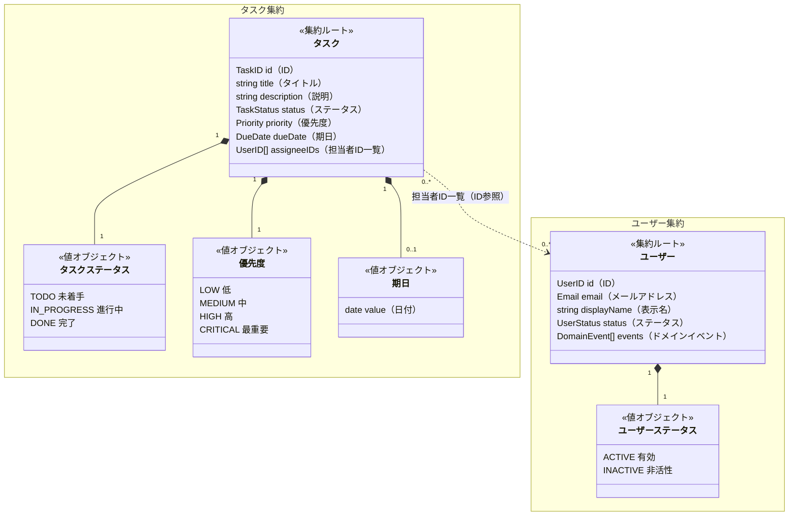

# ドメインモデル

## コアドメイン

**タスク管理**が唯一のコアドメイン。

## サポートドメイン

| ドメイン     | 説明                         |
| ------------ | ---------------------------- |
| ユーザー管理 | ユーザーの登録・非活性化のみ |

## 集約図

---

## タスク集約

### エンティティ・値オブジェクト

#### タスク（集約ルート・エンティティ）

| フィールド                  | 型         | 種別           | 説明                                          |
| --------------------------- | ---------- | -------------- | --------------------------------------------- |
| id（ID）                    | TaskID     | 値オブジェクト | 必須、UUID                                    |
| title（タイトル）           | string     | プリミティブ   | 必須、1〜200文字                              |
| description（説明）         | string     | プリミティブ   | 任意、最大5000文字                            |
| status（ステータス）        | TaskStatus | 値オブジェクト | 必須、列挙型（下記参照）                      |
| priority（優先度）          | Priority   | 値オブジェクト | 必須、列挙型（下記参照）                      |
| dueDate（期日）             | DueDate    | 値オブジェクト | 任意、過去日付不可                            |
| assigneeIDs（担当者ID一覧） | []UserID   | 値オブジェクト | 任意、複数人・0人可、有効ユーザーのIDのみ許可 |

#### タスクステータス（TaskStatus）

| 英語名      | 日本語名 |
| ----------- | -------- |
| TODO        | 未着手   |
| IN_PROGRESS | 進行中   |
| DONE        | 完了     |

#### 優先度（Priority）

| 英語名   | 日本語名 |
| -------- | -------- |
| LOW      | 低       |
| MEDIUM   | 中       |
| HIGH     | 高       |
| CRITICAL | 最重要   |

### ビジネスルール

| #       | ルール                                                                                                                                                                   |
| ------- | ------------------------------------------------------------------------------------------------------------------------------------------------------------------------ |
| BR-T-01 | タスク作成時のステータスは必ず `TODO`（未着手）である                                                                                                                    |
| BR-T-02 | ステータスの遷移順序に制約はない（TODO → DONE なども許可）                                                                                                               |
| BR-T-03 | `dueDate`（期日）には過去の日付を設定できない                                                                                                                            |
| BR-T-04 | `assigneeIDs`（担当者ID一覧）に指定できるのは `ACTIVE` ステータスのユーザーのIDのみ。Task のメソッドが `[]User` を受け取り内部で検証する（内部には `[]UserID` のみ保持） |
| BR-T-05 | `title`（タイトル）は1〜200文字                                                                                                                                          |
| BR-T-06 | `description`（説明）は最大5000文字                                                                                                                                      |

---

## ユーザー集約

### エンティティ・値オブジェクト

#### ユーザー（集約ルート・エンティティ）

| フィールド                 | 型            | 種別             | 説明                 |
| -------------------------- | ------------- | ---------------- | -------------------- |
| id（ID）                   | UserID        | 値オブジェクト   | 必須、UUID           |
| email（メールアドレス）    | Email         | 値オブジェクト   | 必須、一意           |
| displayName（表示名）      | string        | プリミティブ     | 必須、1〜50文字      |
| status（ステータス）       | UserStatus    | 値オブジェクト   | 必須、有効 / 非活性  |
| events（ドメインイベント） | []DomainEvent | ドメインイベント | 未発行イベントキュー |

#### ユーザーステータス（UserStatus）

| 英語名   | 日本語名 |
| -------- | -------- |
| ACTIVE   | 有効     |
| INACTIVE | 非活性   |

### ビジネスルール

| #       | ルール                                                                                      |
| ------- | ------------------------------------------------------------------------------------------- |
| BR-U-01 | `email`（メールアドレス）はシステム全体で一意でなければならない                             |
| BR-U-02 | `displayName`（表示名）は1〜50文字                                                          |
| BR-U-03 | 既に `INACTIVE`（非活性）のユーザーを再度非活性化することはできない（バリデーションエラー） |

### ドメインイベント

| イベント                            | 発行タイミング                   |
| ----------------------------------- | -------------------------------- |
| ユーザー非活性化（UserDeactivated） | ユーザーが非活性に変更されたとき |

#### ユーザー非活性化（UserDeactivated）の副作用

| 副作用                                                   | 対象集約   |
| -------------------------------------------------------- | ---------- |
| すべてのタスクの担当者ID一覧から該当ユーザーIDを削除する | タスク集約 |
