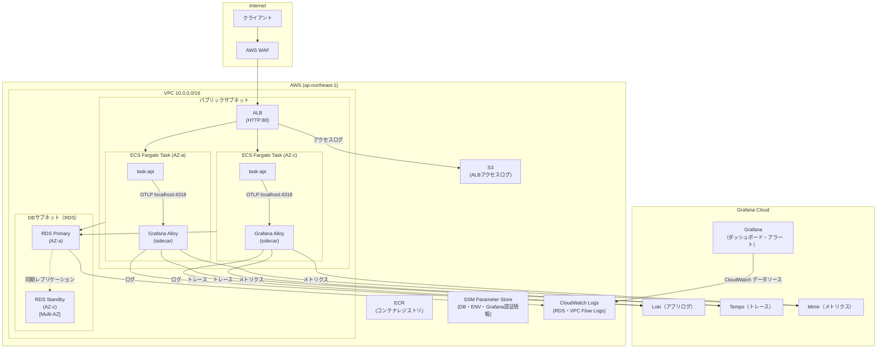
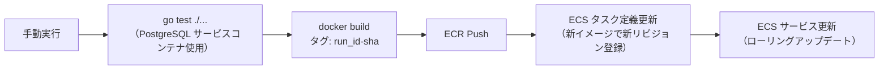
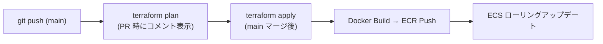

# インフラ仕様書

## 概要

本ドキュメントは、タスク管理バックエンドAPIを AWS 上で運用するためのインフラ構成を定義する。
ALB → ECS (Fargate) → RDS (PostgreSQL) の3層構成を基本とし、本番レベルのセキュリティ・可用性・スケーラビリティ・バックアップを備える。

可観測性は **Grafana Cloud**（Loki・Tempo・Mimir）を中心に構成する。ECS タスク内の **Grafana Alloy サイドカー**がアプリのログ・トレース・メトリクスを収集・転送する。AWS インフラのメトリクス（ECS・ALB・RDS）は Grafana Cloud の CloudWatch データソース経由で参照する。RDS ログ・VPC Flow Logs・ALB アクセスログは従来どおり CloudWatch Logs / S3 に保持し、Grafana Cloud には転送しない。

---

## アーキテクチャ全体図



---

## ネットワーク設計

### VPC

| 項目       | 値                                        |
| ---------- | ----------------------------------------- |
| CIDR       | `10.0.0.0/16`                             |
| リージョン | `ap-northeast-1`（東京）                  |
| AZ数       | 2（`ap-northeast-1a`・`ap-northeast-1c`） |

### サブネット構成

| 種別               | AZ   | CIDR           | 用途                    |
| ------------------ | ---- | -------------- | ----------------------- |
| パブリック         | AZ-a | `10.0.0.0/24`  | ALB・ECS Fargate        |
| パブリック         | AZ-c | `10.0.1.0/24`  | ALB・ECS Fargate        |
| プライベート（DB） | AZ-a | `10.0.20.0/24` | RDS Primary             |
| プライベート（DB） | AZ-c | `10.0.21.0/24` | RDS Standby（Multi-AZ） |

### ゲートウェイ

| 要素             | 配置 | 説明                                     |
| ---------------- | ---- | ---------------------------------------- |
| Internet Gateway | VPC  | パブリックサブネットのインターネット通信 |

ECS タスクをパブリックサブネットに配置し、パブリック IP を付与することで Internet Gateway 経由で ECR pull・SSM 等の外向き通信を行う。NAT Gateway は不要。

### セキュリティグループ

```
Internet (0.0.0.0/0)
  → [ALB-SG] 80/tcp inbound
      → [ECS-SG] 8080/tcp inbound（ALB-SG からのみ）
          → [RDS-SG] 5432/tcp inbound（ECS-SG からのみ）
```

| SG名     | インバウンドルール              | アウトバウンドルール                               |
| -------- | ------------------------------- | -------------------------------------------------- |
| `alb-sg` | 80/tcp from `0.0.0.0/0`（HTTP） | all to `ecs-sg`                                    |
| `ecs-sg` | 8080/tcp from `alb-sg`          | all to `0.0.0.0/0`（ECR pull・Secrets Manager 等） |
| `rds-sg` | 5432/tcp from `ecs-sg`          | なし                                               |

---

## セキュリティ

### WAF（AWS WAF v2）

ALB に紐付けし、以下のルールセットを適用する。

| ルールグループ                       | 目的                                                   |
| ------------------------------------ | ------------------------------------------------------ |
| AWS Managed Rules - Core rule set    | SQLインジェクション・XSS など OWASP Top 10 対策        |
| AWS Managed Rules - Known bad inputs | 既知の悪意あるリクエストパターン遮断                   |
| Rate-based rule                      | 同一 IP からの過剰リクエスト制限（5分間 2,000 req/IP） |

### IAM

#### ECSタスクロール（アプリケーションが使用）

アプリは `os.Getenv` で環境変数を読むだけであり、AWS サービスへの直接アクセスは不要。アプリログ・トレース・メトリクスは Alloy サイドカーが収集・転送するため、CloudWatch Logs への書き込み権限も不要。

| 権限     | 目的 |
| -------- | ---- |
| （なし） | —    |

#### ECSタスク実行ロール（ECS コントロールプレーンが使用）

| 権限                                                | 目的                                               |
| --------------------------------------------------- | -------------------------------------------------- |
| `ecr:GetAuthorizationToken`・`ecr:BatchGetImage` 等 | ECR からのイメージ pull                            |
| `ssm:GetParameters`（特定 ARN のみ）                | タスク定義内 secrets の注入（WithDecryption=true） |
| `kms:Decrypt`（`aws/ssm` キー ARN のみ）            | SecureString パラメータの復号                      |

最小権限の原則に従い、ワイルドカードを使わず特定リソース ARN のみを許可する。

#### Grafana CloudWatch Reader ロール

Grafana Cloud が CloudWatch Metrics を参照するためのクロスアカウントロール。Grafana Cloud のマネージド AWS アカウントから OIDC/ExternalId 付き Assume Role で使用する。

| 権限                       | 目的                               |
| -------------------------- | ---------------------------------- |
| `CloudWatchReadOnlyAccess` | ECS・ALB・RDS メトリクスの読み取り |

```hcl
# terraform/modules/grafana/iam.tf
resource "aws_iam_role" "grafana_cloudwatch_reader" {
  name = "grafana-cloudwatch-reader"
  assume_role_policy = jsonencode({
    Statement = [{
      Effect    = "Allow"
      Principal = { AWS = "arn:aws:iam::<grafana-cloud-account-id>:root" }
      Action    = "sts:AssumeRole"
      Condition = { StringEquals = { "sts:ExternalId" = var.grafana_external_id } }
    }]
  })
}

resource "aws_iam_role_policy_attachment" "grafana_cloudwatch_readonly" {
  role       = aws_iam_role.grafana_cloudwatch_reader.name
  policy_arn = "arn:aws:iam::aws:policy/CloudWatchReadOnlyAccess"
}
```

### SSM Parameter Store

DB パスワード・環境変数・Grafana Cloud 認証情報はすべて SSM Parameter Store（SecureString）に格納し、タスク定義の `secrets` フィールドで環境変数として注入する。Go コードは `os.Getenv` で読むだけで、SSM の API を直接呼ばない。Standard tier を使用するため保存コストは無料。

| パラメータ名                           | 内容                                                      |
| -------------------------------------- | --------------------------------------------------------- |
| `/task-api/prod/db/host`               | `POSTGRES_HOST`                                           |
| `/task-api/prod/db/read-host`          | `POSTGRES_READ_HOST`                                      |
| `/task-api/prod/db/port`               | `POSTGRES_PORT`                                           |
| `/task-api/prod/db/user`               | `POSTGRES_USER`                                           |
| `/task-api/prod/db/password`           | `POSTGRES_PASSWORD`（SecureString・KMS 暗号化）           |
| `/task-api/prod/db/name`               | `POSTGRES_DB`                                             |
| `/task-api/prod/app/port`              | `PORT`                                                    |
| `/task-api/prod/app/locales-dir`       | `LOCALES_DIR`                                             |
| `/task-api/prod/grafana/otlp-endpoint` | `GRAFANA_OTLP_ENDPOINT`（Alloy → Grafana Cloud OTLP URL） |
| `/task-api/prod/grafana/loki-url`      | `GRAFANA_LOKI_URL`（Alloy → Loki Push URL）               |
| `/task-api/prod/grafana/instance-id`   | `GRAFANA_INSTANCE_ID`（Basic 認証ユーザー名）             |
| `/task-api/prod/grafana/token`         | `GRAFANA_TOKEN`（SecureString・API キー）                 |

### VPC Flow Logs

VPC Flow Logs を有効化し、全通信ログを CloudWatch Logs に送信する。異常通信の事後調査に使用する。

---

## ALB（Application Load Balancer）

| 項目       | 値                                 |
| ---------- | ---------------------------------- |
| タイプ     | Application Load Balancer          |
| スキーム   | internet-facing                    |
| サブネット | パブリックサブネット（AZ-a・AZ-c） |
| リスナー   | HTTP:80                            |

### ターゲットグループ

| 項目                         | 値                   |
| ---------------------------- | -------------------- |
| ターゲットタイプ             | `ip`（Fargate 対応） |
| プロトコル                   | HTTP:8080            |
| ヘルスチェックパス           | `GET /health`        |
| ヘルスチェック間隔           | 15秒                 |
| 正常閾値                     | 2回連続成功          |
| 異常閾値                     | 3回連続失敗          |
| ドレイニング（登録解除遅延） | 30秒                 |

### アクセスログ

ALB アクセスログを S3 バケットへ送信し、90日間保持する。Grafana Cloud には転送しない（CloudWatch データソース経由で ALB メトリクスは参照可能）。

---

## ECS（Elastic Container Service）

### クラスター

| 項目               | 値                          |
| ------------------ | --------------------------- |
| 起動タイプ         | Fargate                     |
| Container Insights | 有効（CloudWatch との統合） |

### タスク定義

各タスクは `task-api` と `alloy`（Grafana Alloy サイドカー）の 2 コンテナで構成される。

| 項目               | 値                                                      |
| ------------------ | ------------------------------------------------------- |
| CPU                | 256 vCPU（0.25 vCPU）                                   |
| メモリ             | 512 MiB                                                 |
| ネットワークモード | `awsvpc`                                                |
| イメージ           | ECR の `task-api:latest`（SHA256 ダイジェスト指定推奨） |

コンテナのポートマッピング: `8080/tcp`

環境変数はすべて SSM Parameter Store から `secrets` フィールドで注入し、タスク定義にハードコードしない。

#### task-api コンテナ

| 項目           | 値                                                  |
| -------------- | --------------------------------------------------- |
| ログドライバー | なし（stdout は Alloy サイドカーが収集）            |
| 環境変数       | `OTEL_EXPORTER_OTLP_ENDPOINT=http://localhost:4318` |
| dependsOn      | `alloy` コンテナが `START` 状態になるまで待機       |

#### Grafana Alloy サイドカーコンテナ

ECS タスク内でアプリと同じネットワーク名前空間を共有するため、`localhost:4318` で OTLP を受信できる。

| 項目     | 値                                            |
| -------- | --------------------------------------------- |
| イメージ | `grafana/alloy:latest`                        |
| CPU      | 64 vCPU（タスク全体の 256 から割り当て）      |
| メモリ   | 128 MiB                                       |
| ポート   | 4317（gRPC）・4318（HTTP）                    |
| 設定     | SSM から注入した Grafana Cloud 認証情報を参照 |

Alloy の役割：

| 入力                        | 出力先              |
| --------------------------- | ------------------- |
| OTLP ログ（localhost:4318） | Grafana Cloud Loki  |
| OTLP トレース               | Grafana Cloud Tempo |
| OTLP メトリクス             | Grafana Cloud Mimir |
| コンテナ stdout（ファイル） | Grafana Cloud Loki  |

Alloy 設定ファイル（`/etc/alloy/config.alloy`）はタスク定義のボリュームマウントで渡す。

```hcl
// OTLP 受信（アプリから）
otelcol.receiver.otlp "default" {
  http { endpoint = "0.0.0.0:4318" }
  grpc { endpoint = "0.0.0.0:4317" }
  output {
    logs    = [otelcol.exporter.otlphttp.grafana.input]
    traces  = [otelcol.exporter.otlphttp.grafana.input]
    metrics = [otelcol.exporter.otlphttp.grafana.input]
  }
}

// Grafana Cloud への転送
otelcol.exporter.otlphttp "grafana" {
  client {
    endpoint = env("GRAFANA_OTLP_ENDPOINT")
    auth     = otelcol.auth.basic.grafana.handler
  }
}

otelcol.auth.basic "grafana" {
  username = env("GRAFANA_INSTANCE_ID")
  password = env("GRAFANA_TOKEN")
}

// コンテナ stdout ログの収集
loki.source.file "containers" {
  targets    = [{ __path__ = "/var/log/containers/task-api*.log" }]
  forward_to = [loki.write.grafana.receiver]
}

loki.write "grafana" {
  endpoint {
    url = env("GRAFANA_LOKI_URL")
    basic_auth {
      username = env("GRAFANA_INSTANCE_ID")
      password = env("GRAFANA_TOKEN")
    }
  }
}
```

### サービス

| 項目                           | 値                                                   |
| ------------------------------ | ---------------------------------------------------- |
| サービスタイプ                 | `REPLICA`                                            |
| パブリック IP 付与             | 有効（`assignPublicIp: ENABLED`）                    |
| 配置サブネット                 | パブリックサブネット（`10.0.0.0/24`・`10.0.1.0/24`） |
| 最小ヘルシーパーセント         | 100%（ローリングアップデート中にタスク数を維持）     |
| 最大パーセント                 | 200%                                                 |
| デプロイメント                 | ローリングアップデート                               |
| サーキットブレーカー           | 有効（異常デプロイの自動ロールバック）               |
| ヘルスチェックグレースピリオド | 30秒                                                 |

### Auto Scaling

ALB リクエスト数をトリガーとしたターゲット追跡スケーリングを使用する。

| ポリシー                         | メトリクス                      | 目標値        |
| -------------------------------- | ------------------------------- | ------------- |
| ターゲット追跡（スケールアウト） | タスクあたりの ALB リクエスト数 | 1,000 req/min |
| ターゲット追跡（CPU）            | CPU 使用率                      | 70%           |

| 項目                        | 値                                    |
| --------------------------- | ------------------------------------- |
| 最小タスク数                | 2（Multi-AZ で各 AZ に 1 タスク以上） |
| 最大タスク数                | 10                                    |
| スケールアウト クールダウン | 60秒                                  |
| スケールイン クールダウン   | 300秒                                 |

### ECR（コンテナレジストリ）

| 項目                   | 値                                                        |
| ---------------------- | --------------------------------------------------------- |
| レポジトリ名           | `task-api`                                                |
| イメージスキャン       | push 時に自動スキャン（脆弱性検知）                       |
| ライフサイクルポリシー | 最新 10 イメージを保持、それ以前を自動削除                |
| イメージタグ           | `YYYYMMDD-<gitsha>` 形式（`latest` タグを本番に使わない） |

---

## RDS（Relational Database Service）

### インスタンス構成

| 項目                 | 値                                                             |
| -------------------- | -------------------------------------------------------------- |
| エンジン             | PostgreSQL 16                                                  |
| インスタンスクラス   | `db.t4g.micro`（スモールスタート、必要に応じてスケールアップ） |
| ストレージ           | gp3・20 GiB・自動スケーリング有効（最大 100 GiB）              |
| Multi-AZ             | 有効（Standby インスタンスを AZ-c に配置）                     |
| DBサブネットグループ | DBサブネット（`10.0.20.0/24`・`10.0.21.0/24`）を使用           |

### Read Replica

CQRS クエリ側（読み取り）の負荷を Primary から分離するために Read Replica を 1 台配置する。

| 項目               | 値                                                |
| ------------------ | ------------------------------------------------- |
| インスタンスクラス | `db.t4g.micro`（Primary と同クラス）              |
| 配置 AZ            | `ap-northeast-1c`（Primary と異なる AZ）          |
| Multi-AZ           | 無効（読み取り不可時は Primary にフォールバック） |
| レプリケーション   | 非同期（Primary → Replica）                       |
| エンドポイント     | 専用 DNS（Primary エンドポイントとは別）          |

ECS タスクは書き込みを Primary エンドポイント（`POSTGRES_HOST`）、読み取りを Replica エンドポイント（`POSTGRES_READ_HOST`）に向ける。

#### Primary 障害時の挙動

```
Primary 障害 → Multi-AZ Standby が自動昇格（新 Primary）
  → Read Replica は新 Primary からレプリケーションを再確立
  → Replica エンドポイントの DNS は変わらず ECS の設定変更不要
```

### 高可用性

Multi-AZ 配置により、Primary 障害時は数分以内に Standby が自動昇格する（フェイルオーバー）。ECS タスクは RDS のエンドポイント（DNS）を使用するため、フェイルオーバー後も接続先変更不要。gorm の接続リトライ設定で一時的な切断に対応する。

### セキュリティ

| 項目                   | 設定                                               |
| ---------------------- | -------------------------------------------------- |
| 保管時暗号化           | 有効（AWS KMS 管理キー）                           |
| 通信暗号化             | SSL/TLS 強制（`rds.force_ssl = 1`）                |
| パスワード管理         | Secrets Manager で管理・自動ローテーション（30日） |
| パブリックアクセス     | 無効                                               |
| メンテナンスウィンドウ | 日曜 03:00–04:00 JST（低トラフィック時間帯）       |

### パラメータグループ

| パラメータ                   | 値                   | 理由                                  |
| ---------------------------- | -------------------- | ------------------------------------- |
| `log_min_duration_statement` | 1000（ms）           | スロークエリを CloudWatch Logs に出力 |
| `log_connections`            | 1                    | 接続ログを記録                        |
| `log_disconnections`         | 1                    | 切断ログを記録                        |
| `shared_preload_libraries`   | `pg_stat_statements` | クエリ統計の収集                      |

---

## バックアップ戦略

### RDS 自動バックアップ

| 項目                       | 値                                    |
| -------------------------- | ------------------------------------- |
| 保持期間                   | 7日間                                 |
| バックアップウィンドウ     | 18:00–19:00 UTC（03:00–04:00 JST）    |
| ポイントインタイムリカバリ | 有効（5分前まで任意の時点に復元可能） |

### 手動スナップショット

本番スキーマ変更・大型デプロイ前に手動スナップショットを取得する。スナップショット名: `task-api-pre-<YYYYMMDD>-<変更内容>`。

### バックアップ復元手順

```
1. RDS コンソールで対象スナップショットを選択
2. 「スナップショットから復元」→ 新規 DB インスタンスとして起動
3. ECS タスク定義の DB エンドポイントを新インスタンスに切り替え
4. サービスを強制デプロイ
```

### ECR イメージ保持

直近 10 イメージを保持することで、コンテナのロールバックに備える。

---

## 可観測性（監視・ログ・アラート・トレース）

### データ送信先サマリー

| データ種別                 | 送信先                            | 用途                           |
| -------------------------- | --------------------------------- | ------------------------------ |
| アプリログ（stdout）       | Grafana Cloud Loki                | ログ検索・アラート             |
| トレース                   | Grafana Cloud Tempo               | リクエスト追跡・レイテンシ分析 |
| アプリカスタムメトリクス   | Grafana Cloud Mimir               | ダッシュボード・アラート       |
| ECS・ALB・RDS メトリクス   | CloudWatch → Grafana データソース | ダッシュボード・アラート       |
| RDS スロークエリ・接続ログ | CloudWatch Logs のみ              | スロークエリ調査（直接参照）   |
| VPC Flow Logs              | CloudWatch Logs のみ              | 異常通信の事後調査（直接参照） |
| ALB アクセスログ           | S3 のみ                           | 詳細リクエスト調査（直接参照） |

### Grafana Cloud — ログ（Loki）

Grafana Alloy サイドカーが収集するログ。

| ログ種別             | ラベル例                          | 保持期間（Grafana Cloud Free） |
| -------------------- | --------------------------------- | ------------------------------ |
| アプリケーションログ | `service=task-api`, `level=error` | 14日                           |

アプリは `slog`（JSON 形式）でログを出力し、Alloy がラベルを付与して Loki に送信する。

### Grafana Cloud — トレース（Tempo）

`otelhttp.NewHandler` による HTTP リクエストの自動計装と `gormotel.NewPlugin()` による GORM クエリの自動計装で、リクエスト全体のトレースを取得する。

| スパン種別      | 取得内容                                     |
| --------------- | -------------------------------------------- |
| HTTP リクエスト | メソッド・パス・ステータスコード・レイテンシ |
| DB クエリ       | SQL・実行時間・エラー                        |

### Grafana Cloud — メトリクス（Mimir）

OTel Metrics SDK でアプリが生成したカスタムメトリクスを Alloy 経由で Mimir に送信する。

| メトリクス名                   | 内容                      |
| ------------------------------ | ------------------------- |
| `http.server.request.duration` | HTTP リクエストレイテンシ |
| `http.server.active_requests`  | 処理中リクエスト数        |
| `db.client.operation.duration` | DB クエリレイテンシ       |

### Grafana Cloud — CloudWatch データソース

Grafana Cloud が `grafana-cloudwatch-reader` IAM ロールを Assume Role して CloudWatch Metrics を直接クエリする。データのコピーは不要。

取得できる主なメトリクス：

| 名前空間             | メトリクス例                              |
| -------------------- | ----------------------------------------- |
| `AWS/ECS`            | CPU 使用率・メモリ使用率・タスク数        |
| `AWS/ApplicationELB` | リクエスト数・5xx 率・レイテンシ p50/p99  |
| `AWS/RDS`            | CPU・接続数・空きストレージ・レプリカラグ |

### Grafana Cloud — アラート（Grafana Alerting）

Grafana Alerting で全アラートを一元管理する。通知先は Grafana の Notification Policy で設定。

| アラート                          | データソース | 条件                 |
| --------------------------------- | ------------ | -------------------- |
| ECS CPU 使用率 > 80%（5分間）     | CloudWatch   | Average > 80         |
| ECS メモリ使用率 > 80%（5分間）   | CloudWatch   | Average > 80         |
| ALB 5xx エラー率 > 5%（5分間）    | CloudWatch   | Average > 5          |
| ALB レイテンシ p99 > 2秒（5分間） | CloudWatch   | p99 > 2000ms         |
| RDS CPU 使用率 > 80%（5分間）     | CloudWatch   | Average > 80         |
| RDS 空きストレージ < 5 GiB        | CloudWatch   | Average < 5368709120 |
| RDS 接続数 > 80%（最大接続数比）  | CloudWatch   | Average > 閾値       |
| アプリエラー率 > 1%               | Loki / Mimir | HTTP 5xx 率が上昇    |

### CloudWatch Logs（直接参照）

RDS ログ・VPC Flow Logs は Grafana Cloud に転送せず、CloudWatch Logs で直接参照する。

| ロググループ                               | ログ種別                          | 保持期間 |
| ------------------------------------------ | --------------------------------- | -------- |
| `/aws/rds/instance/task-api-db/postgresql` | PostgreSQL スロークエリ・接続ログ | 30日     |
| `/aws/vpc/flowlogs`                        | VPC Flow Logs                     | 14日     |

### Grafana Cloud ダッシュボード

以下のウィジェットを 1 画面に集約する。

- ALB リクエスト数・5xx 率・レイテンシ p50/p99（CloudWatch データソース）
- ECS タスク数・CPU/メモリ使用率（CloudWatch データソース）
- RDS CPU・DBコネクション数・空きストレージ・レプリカラグ（CloudWatch データソース）
- アプリ HTTP エラー率・レイテンシ分布（Mimir）
- トレース一覧・スロークエリ上位（Tempo）

---

## CI/CD パイプライン

`deploy.yml`・`ci.yml` は手動実行（`workflow_dispatch`）のみで起動する。`destroy.yml` は毎日深夜3時（JST）にスケジュール実行し、AWS リソースを自動削除することで料金発生を抑制する。
IAM 権限は OIDC（OpenID Connect）で Assume Role し、長期 Access Key を使用しない。

### ワークフロー一覧

| ファイル      | ワークフロー名        | 用途                                                                  | 使用 IAM ロール          |
| ------------- | --------------------- | --------------------------------------------------------------------- | ------------------------ |
| `deploy.yml`  | Deploy to AWS         | Terraform apply でインフラ全体を構築                                  | `AWS_TERRAFORM_ROLE_ARN` |
| `destroy.yml` | Destroy AWS Resources | Terraform destroy でリソースをすべて削除（毎日 03:00 JST に自動実行） | `AWS_TERRAFORM_ROLE_ARN` |
| `ci.yml`      | CI/CD                 | テスト・ビルド・ECR プッシュ・ECS デプロイ                            | `AWS_DEPLOY_ROLE_ARN`    |

GitHub Actions Secrets に以下を登録する。

| Secret 名                | 内容                                                  |
| ------------------------ | ----------------------------------------------------- |
| `AWS_TERRAFORM_ROLE_ARN` | Terraform 実行ロールの ARN（インフラ管理権限）        |
| `AWS_DEPLOY_ROLE_ARN`    | デプロイロールの ARN（ECR push・ECS update 権限のみ） |

### deploy.yml — Deploy to AWS

Terraform apply でインフラ全体を構築する。

```yaml
name: Deploy to AWS
on:
  workflow_dispatch:
permissions:
  id-token: write
  contents: read
jobs:
  terraform-apply:
    runs-on: ubuntu-latest
    defaults:
      run:
        working-directory: terraform/environments/prod
    steps:
      - uses: actions/checkout@v4
      - uses: aws-actions/configure-aws-credentials@v4
        with:
          role-to-assume: ${{ secrets.AWS_TERRAFORM_ROLE_ARN }}
          aws-region: ap-northeast-1
      - uses: hashicorp/setup-terraform@v3
      - run: terraform init
      - run: terraform plan
      - run: terraform apply -auto-approve
```

### destroy.yml — Destroy AWS Resources

毎日 03:00 JST（= 18:00 UTC）にスケジュール実行し、Terraform destroy で AWS リソースをすべて削除する。

```yaml
name: Destroy AWS Resources
on:
  schedule:
    - cron: "0 18 * * *" # 毎日 03:00 JST
  workflow_dispatch:
permissions:
  id-token: write
  contents: read
jobs:
  terraform-destroy:
    runs-on: ubuntu-latest
    defaults:
      run:
        working-directory: terraform/environments/prod
    steps:
      - uses: actions/checkout@v4
      - uses: aws-actions/configure-aws-credentials@v4
        with:
          role-to-assume: ${{ secrets.AWS_TERRAFORM_ROLE_ARN }}
          aws-region: ap-northeast-1
      - uses: hashicorp/setup-terraform@v3
      - run: terraform init
      - run: terraform destroy -auto-approve
```

### ci.yml — CI/CD

Go テスト・Docker ビルド・ECR プッシュ・ECS タスク定義更新を順に実行する。



| ステップ         | 内容                                                                                            |
| ---------------- | ----------------------------------------------------------------------------------------------- |
| テスト           | PostgreSQL サービスコンテナを起動し `go test ./...` を実行。環境変数はジョブの `env` で直接注入 |
| ビルド           | `docker build` でイメージを作成。タグは `${{ github.run_id }}-${{ github.sha }}`                |
| プッシュ         | ECR にプッシュ                                                                                  |
| タスク定義更新   | ECS から現在のタスク定義を取得し、コンテナイメージのみ新タグに差し替えて新リビジョンを登録      |
| ECS デプロイ     | `aws-actions/amazon-ecs-deploy-task-definition` でローリングアップデート。サービス安定まで待機  |
| 自動ロールバック | ECS サーキットブレーカーにより、ヘルスチェック失敗が続くと旧リビジョンに自動ロールバック        |

```yaml
name: CI/CD
on:
  workflow_dispatch:
permissions:
  id-token: write
  contents: read
jobs:
  ci:
    runs-on: ubuntu-latest
    services:
      postgres:
        image: postgres:16
        env:
          POSTGRES_USER: postgres
          POSTGRES_PASSWORD: postgres
          POSTGRES_DB: taskdb
        ports:
          - 5432:5432
        options: >-
          --health-cmd pg_isready
          --health-interval 10s
          --health-timeout 5s
          --health-retries 5
    steps:
      - uses: actions/checkout@v4
      - uses: actions/setup-go@v5
        with:
          go-version-file: backend/go.mod
      - name: Run tests
        working-directory: backend
        env:
          POSTGRES_HOST: localhost
          POSTGRES_PORT: 5432
          POSTGRES_USER: postgres
          POSTGRES_PASSWORD: postgres
          POSTGRES_DB: taskdb
          PORT: 8080
          LOCALES_DIR: ./locales
        run: go test ./...
      - uses: aws-actions/configure-aws-credentials@v4
        with:
          role-to-assume: ${{ secrets.AWS_DEPLOY_ROLE_ARN }}
          aws-region: ap-northeast-1
      - name: Login to ECR
        id: login-ecr
        uses: aws-actions/amazon-ecr-login@v2
      - name: Build and push Docker image
        id: build
        working-directory: backend
        env:
          REGISTRY: ${{ steps.login-ecr.outputs.registry }}
          REPOSITORY: task-api
          IMAGE_TAG: ${{ github.run_id }}-${{ github.sha }}
        run: |
          docker build -t $REGISTRY/$REPOSITORY:$IMAGE_TAG .
          docker push $REGISTRY/$REPOSITORY:$IMAGE_TAG
          echo "image=$REGISTRY/$REPOSITORY:$IMAGE_TAG" >> $GITHUB_OUTPUT
      - name: Download current task definition
        run: |
          aws ecs describe-task-definition \
            --task-definition task-api \
            --query taskDefinition \
            > task-definition.json
      - name: Update task definition with new image
        id: task-def
        uses: aws-actions/amazon-ecs-render-task-definition@v1
        with:
          task-definition: task-definition.json
          container-name: task-api
          image: ${{ steps.build.outputs.image }}
      - name: Deploy to ECS
        uses: aws-actions/amazon-ecs-deploy-task-definition@v2
        with:
          task-definition: ${{ steps.task-def.outputs.task-definition }}
          service: task-api-service
          cluster: task-api-cluster
          wait-for-service-stability: true
```

---

## スケーラビリティ設計

### ECS 水平スケーリング

ALB リクエスト数・CPU 使用率に応じて ECS Auto Scaling が自動でタスクを増減する（詳細は ECS セクション参照）。Fargate のためインフラのキャパシティ管理が不要。

### RDS スケールアップ

縦スケールはインスタンスクラスの変更で対応する。Multi-AZ 環境ではフェイルオーバーを利用した無停止スケールアップが可能（メンテナンスウィンドウで実施）。

| トリガー                 | 対応                                                                                |
| ------------------------ | ----------------------------------------------------------------------------------- |
| RDS CPU 高騰・接続数逼迫 | `db.t4g.micro` → `db.t4g.small` → `db.t4g.medium` → `db.r8g.large` へスケールアップ |
| 読み取りが多い           | RDS Read Replica を追加し、クエリ側の読み取り先を Replica に向ける                  |

### コネクションプーリング

ECS タスクが増加すると DB コネクション数が増大する。Go アプリ（gorm）は 1 タスクあたり `MaxOpenConns` で設定した数のコネクションを RDS に張るため、RDS への総接続数は「タスク数 × MaxOpenConns」になる。これが RDS の最大接続数（インスタンスクラス依存）に近づいた場合は、**PgBouncer 専用タスク**を導入してコネクションプーリングを行う。

サイドカー方式（各 ECS タスクに PgBouncer を同居）では、タスクが増えるほど RDS への接続数も比例して増えるため接続数の節約にならない。専用タスク方式では全 ECS タスクが共通の PgBouncer を経由するため、RDS への接続数を PgBouncer のプールサイズ（固定値）に抑えられる。

```
ECS タスク × N  →  PgBouncer 専用タスク（pool_size=20）  →  RDS
                   ※ RDS 接続数は N に依らず最大 20 に固定
```

PgBouncer 専用タスクは単一障害点にならないよう 2 タスク以上（Multi-AZ）を ECS サービスとして常時起動し、ALB とは別の内部向け NLB またはサービスディスカバリ（Cloud Map）で ECS タスクからルーティングする。

---

## 環境変数管理（本番）

ローカル開発の `.env.local` に相当するものが本番では SSM Parameter Store となる。

| ローカル（`.env.local`）       | 本番（SSM Parameter Store）                    |
| ------------------------------ | ---------------------------------------------- |
| `POSTGRES_HOST=localhost`      | `/task-api/prod/db/host`                       |
| `POSTGRES_READ_HOST=localhost` | `/task-api/prod/db/read-host`                  |
| `POSTGRES_PORT=5432`           | `/task-api/prod/db/port`                       |
| `POSTGRES_USER=...`            | `/task-api/prod/db/user`                       |
| `POSTGRES_PASSWORD=...`        | `/task-api/prod/db/password`（SecureString）   |
| `POSTGRES_DB=...`              | `/task-api/prod/db/name`                       |
| `PORT=8080`                    | `/task-api/prod/app/port`                      |
| `LOCALES_DIR=./locales`        | `/task-api/prod/app/locales-dir`               |
| （ローカル不要）               | `/task-api/prod/grafana/otlp-endpoint`         |
| （ローカル不要）               | `/task-api/prod/grafana/loki-url`              |
| （ローカル不要）               | `/task-api/prod/grafana/instance-id`           |
| （ローカル不要）               | `/task-api/prod/grafana/token`（SecureString） |

Go コードは `os.Getenv` で読む実装のまま変更不要。ECS タスク定義の `secrets` フィールドがコンテナ起動時に SSM Parameter Store から取得して環境変数に展開する。

---

## 概算料金

ap-northeast-1・オンデマンド料金の月額概算（トラフィック最小時）。

| サービス                              | 単価                      | 月額概算   |
| ------------------------------------- | ------------------------- | ---------- |
| RDS Primary（db.t4g.micro・Multi-AZ） | $0.032/hr                 | 約 $23     |
| RDS Read Replica（db.t4g.micro）      | $0.016/hr                 | 約 $12     |
| RDS ストレージ（20 GiB・gp3）         | $0.138/GiB/月             | 約 $3      |
| ECS Fargate（最小 2 タスク）          | vCPU $0.04656/hr + メモリ | 約 $21     |
| ECS パブリック IP（最小 2 IP）        | $0.005/IP/hr              | 約 $7      |
| ALB                                   | $0.0243/hr + LCU          | 約 $18     |
| WAF（マネージドルール 3 つ）          | WebACL $5 + ルール $1×3   | 約 $8      |
| CloudWatch（RDS・VPC Flow Logs のみ） | 従量課金                  | 約 $2      |
| Grafana Cloud                         | Free tier（小規模利用内） | $0         |
| ECR・S3・SSM                          | 従量課金                  | 約 $2      |
| **合計**                              |                           | **約 $96** |

Grafana Cloud Free tier の上限（ログ 50GB/月・メトリクス 10k series・トレース 50GB/月）を超えた場合は従量課金（$29/月〜）。CloudWatch のログ取り込み費用が削減される分、以前より若干安くなる。

---

## コスト最適化

| 施策                      | 内容                                                                             |
| ------------------------- | -------------------------------------------------------------------------------- |
| Fargate Spot              | ステージング環境など中断許容可能な環境では Fargate Spot を活用してコストを削減   |
| RDS 予約インスタンス      | 1年以上安定運用が確定したタイミングで Reserved Instance（1年・No Upfront）を購入 |
| S3 ライフサイクル         | ALB ログは 90日後に S3 Glacier へ移行                                            |
| Auto Scaling スケールイン | 低トラフィック時は最小タスク数まで縮退しコストを抑制                             |

---

## Terraform

### tfstate 管理

tfstate は S3 に保存し、DynamoDB でロックする。

| リソース                    | 設定                                              |
| --------------------------- | ------------------------------------------------- |
| S3 バケット名               | `task-api-tfstate-<account-id>`（グローバル一意） |
| バージョニング              | 有効（state 破損時のロールバック）                |
| 暗号化                      | SSE-S3（AES-256）                                 |
| パブリックアクセス          | 完全ブロック                                      |
| DynamoDB テーブル名         | `task-api-tfstate-lock`                           |
| DynamoDB パーティションキー | `LockID`（String）                                |
| DynamoDB 課金モード         | PAY_PER_REQUEST（apply 時のみ課金、月数円以下）   |

S3 バケットと DynamoDB テーブル自体は Terraform で管理すると鶏卵問題が生じるため、`terraform/bootstrap/` で初回のみ手動適用する。

```hcl
# terraform/environments/prod/backend.tf
terraform {
  backend "s3" {
    bucket         = "task-api-tfstate-<account-id>"
    key            = "prod/terraform.tfstate"
    region         = "ap-northeast-1"
    encrypt        = true
    dynamodb_table = "task-api-tfstate-lock"
  }
}
```

### ディレクトリ構成

```
terraform/
├── bootstrap/               # tfstate 用 S3・DynamoDB（初回のみ手動適用）
│   └── main.tf
├── environments/
│   └── prod/
│       ├── main.tf          # モジュール呼び出し・プロバイダー設定
│       ├── variables.tf
│       ├── outputs.tf
│       └── terraform.tfvars # 実値（gitignore 対象）
└── modules/
    ├── vpc/                 # VPC・サブネット・IGW・NAT Gateway・ルートテーブル
    ├── alb/                 # ALB・リスナー・ターゲットグループ
    ├── waf/                 # WAF WebACL・マネージドルール
    ├── ecs/                 # クラスター・タスク定義（task-api + Alloy サイドカー）・サービス・Auto Scaling
    ├── ecr/                 # ECR リポジトリ・ライフサイクルポリシー
    ├── rds/                 # RDS インスタンス・サブネットグループ・パラメータグループ
    ├── ssm/                 # SSM Parameter Store パラメータ（DB・ENV・Grafana認証情報）
    ├── iam/                 # タスクロール・タスク実行ロール・Terraform 実行ロール・Grafana CloudWatch Reader ロール
    └── grafana/             # Grafana CloudWatch Reader IAM ロール・Alloy 設定ファイル管理
```

### Terraform 実行ロール（IAM）

GitHub Actions から OIDC で Assume Role する Terraform 実行ロール。以下のポリシーを付与する。

| 対象サービス        | 必要な権限（例）                                                                   |
| ------------------- | ---------------------------------------------------------------------------------- |
| VPC・サブネット・SG | `ec2:*`（対象リソースに限定）                                                      |
| ALB                 | `elasticloadbalancing:*`                                                           |
| WAF                 | `wafv2:*`                                                                          |
| ECS                 | `ecs:*`                                                                            |
| ECR                 | `ecr:*`                                                                            |
| RDS                 | `rds:*`                                                                            |
| SSM Parameter Store | `ssm:PutParameter`・`ssm:GetParameter`・`ssm:DeleteParameter`                      |
| KMS                 | `kms:*`（aws/ssm キーに限定）                                                      |
| IAM                 | `iam:CreateRole`・`iam:AttachRolePolicy`・`iam:PassRole` 等                        |
| CloudWatch          | `logs:*`・`cloudwatch:*`                                                           |
| S3（tfstate）       | `s3:GetObject`・`s3:PutObject`・`s3:ListBucket`（tfstate バケットのみ）            |
| DynamoDB（lock）    | `dynamodb:GetItem`・`dynamodb:PutItem`・`dynamodb:DeleteItem`（lock テーブルのみ） |

### 適用フロー

```
初回セットアップ:
  cd terraform/bootstrap && terraform init && terraform apply
  → S3 バケット・DynamoDB テーブルが作成される

以降（CI/CD または手動）:
  cd terraform/environments/prod
  terraform init        # S3 バックエンドに接続
  terraform plan        # 差分確認
  terraform apply       # 適用（GitHub Actions は main push 時に自動実行）
```

### CI/CD との統合

GitHub Actions の Terraform ジョブは ECS デプロイより前段に置く。



| ブランチ・イベント | 実行内容                                        |
| ------------------ | ----------------------------------------------- |
| PR 作成・更新      | `terraform plan` を実行し結果を PR にコメント   |
| main へのマージ    | `terraform apply` → Docker Build → ECS デプロイ |

---

## 障害対応シナリオ

### ECS タスク障害

ECS が自動でタスクを再起動する。ALB ヘルスチェックにより異常タスクはルーティング対象から除外され、サービスへの影響は最小化される。

### RDS Primary 障害

Multi-AZ フェイルオーバーにより Standby が自動昇格する（目安: 60–120秒）。ECS タスクは接続エラー後にリトライし、DNS 切り替え後に自動で新 Primary に接続する。

### AZ 障害

- ALB は残存 AZ のターゲットにのみルーティングする
- ECS Auto Scaling が残存 AZ のサブネットにタスクを追加する
- RDS は Multi-AZ によりフェイルオーバーする
- NAT Gateway は AZ ごとに配置しているため外向き通信も維持される

### デプロイ失敗

ECS サーキットブレーカーにより自動ロールバックされる。手動で旧タスク定義バージョンへのロールバックも可能（`aws ecs update-service --task-definition <前バージョン>`）。
