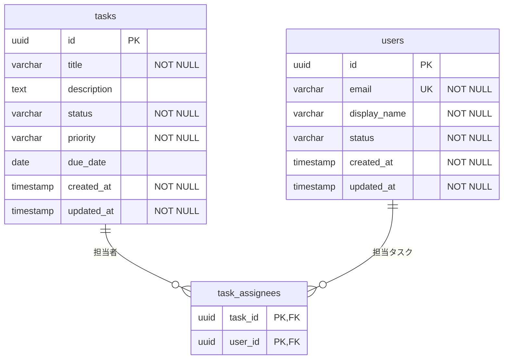

# DBスキーマ定義書

## ER図

---

## テーブル定義

### users

| カラム名 | 型 | 制約 | 説明 |
|---|---|---|---|
| id | UUID | PK, NOT NULL | ユーザーID |
| email | VARCHAR(255) | UNIQUE, NOT NULL | メールアドレス |
| display_name | VARCHAR(50) | NOT NULL | 表示名 |
| status | VARCHAR(20) | NOT NULL | ユーザーステータス（ACTIVE / INACTIVE） |
| created_at | TIMESTAMP | NOT NULL | 作成日時 |
| updated_at | TIMESTAMP | NOT NULL | 更新日時 |

### tasks

| カラム名 | 型 | 制約 | 説明 |
|---|---|---|---|
| id | UUID | PK, NOT NULL | タスクID |
| title | VARCHAR(200) | NOT NULL | タイトル |
| description | TEXT | | 説明 |
| status | VARCHAR(20) | NOT NULL | ステータス（TODO / IN_PROGRESS / DONE） |
| priority | VARCHAR(20) | NOT NULL | 優先度（LOW / MEDIUM / HIGH / CRITICAL） |
| due_date | DATE | | 期日 |
| created_at | TIMESTAMP | NOT NULL | 作成日時 |
| updated_at | TIMESTAMP | NOT NULL | 更新日時 |

### task_assignees

| カラム名 | 型 | 制約 | 説明 |
|---|---|---|---|
| task_id | UUID | PK, FK → tasks.id, NOT NULL | タスクID |
| user_id | UUID | PK, FK → users.id, NOT NULL | ユーザーID |

---

## ドメインモデルとのマッピング

| ドメインモデル | 種別 | DBマッピング |
|---|---|---|
| Task.id（TaskID） | 値オブジェクト | tasks.id（UUID） |
| Task.title | プリミティブ | tasks.title（VARCHAR(200)） |
| Task.description | プリミティブ | tasks.description（TEXT） |
| Task.status（TaskStatus） | 値オブジェクト | tasks.status（VARCHAR(20)）にフラット化 |
| Task.priority（Priority） | 値オブジェクト | tasks.priority（VARCHAR(20)）にフラット化 |
| Task.dueDate（DueDate） | 値オブジェクト | tasks.due_date（DATE）にフラット化 |
| Task.assigneeIDs（[]UserID） | 値オブジェクト | task_assignees 中間テーブルで表現 |
| User.id（UserID） | 値オブジェクト | users.id（UUID） |
| User.email（Email） | 値オブジェクト | users.email（VARCHAR(255)）にフラット化 |
| User.displayName | プリミティブ | users.display_name（VARCHAR(50)） |
| User.status（UserStatus） | 値オブジェクト | users.status（VARCHAR(20)）にフラット化 |
| User.events（[]DomainEvent） | ドメインイベント | DBに永続化しない（インメモリで処理） |
